# 📋 Pymo — Especificación de API Backend

> **Audiencia:** Equipo de desarrollo Mekano (backend) + Equipo Pymo (frontend)  
> **Versión:** 1.0 — Marzo 2026  
> **Base URL:** Configurable por tenant (ver sección "Configuración Multi-Tenant")

---

## Arquitectura

Pymo es una **app móvil para vendedores** que consume endpoints creados por el equipo de **Mekano**. No tiene backend propio — todo pasa por los endpoints de Mekano.

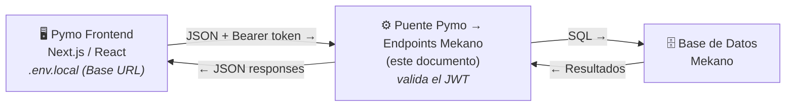

| Rol | Responsabilidad |
|---|---|
| **Mekano (backend)** | Crear los endpoints listados aquí. Manejar la lógica de negocio, validaciones, y acceso a la base de datos |
| **Pymo (frontend)** | Consumir los endpoints. Enviar los inputs descritos y mostrar los outputs al vendedor |

> ⚠️ **Importante:**
> Este documento define **exactamente** qué inputs envía Pymo y qué outputs necesita recibir. Cada endpoint incluye los campos, tipos, y ejemplos completos de request/response. El equipo Mekano puede implementarlos internamente como prefiera, siempre que respeten esta especificación.

---

## Configuración Multi-Tenant

Pymo se instala para **múltiples clientes/tenants**, cada uno con su propia base de datos y URL. La configuración se externaliza en un archivo `.env.local` que **no se sube a git**.

```bash
# .env.local (un archivo por cada instalación)
NEXT_PUBLIC_API_BASE_URL=https://fruggy.pymo.io/api
```

| Variable | Descripción | Ejemplo |
|---|---|---|
| `NEXT_PUBLIC_API_BASE_URL` | URL base del puente Pymo del tenant. **No es un secreto.** | `https://fruggy.pymo.io/api`, `https://tienda.pymo.io/api` |

> ⚠️ **Importante:**
> No se envía ninguna API key estática desde el cliente. La autenticación es por **token (JWT)** emitido por el puente en `POST /auth/login` (ver [ARQUITECTURA_SEGURIDAD.md](./ARQUITECTURA_SEGURIDAD.md)). Para cambiar de tenant, solo se edita `.env.local` y se reinicia el servidor.

**Cómo el frontend consume las APIs:**

Todas las llamadas pasan por `apiFetch()` en `app/config/api.ts`, que automáticamente:
- Prepende el `NEXT_PUBLIC_API_BASE_URL` a la ruta
- Agrega `Authorization: Bearer <token>` cuando hay sesión iniciada
- Agrega `Content-Type: application/json`

```ts
// Ejemplo de consumo:
const res = await apiFetch("/productos"); 
// → GET https://fruggy.pymo.io/api/productos
// → Headers: { "Authorization": "Bearer eyJ...", "Content-Type": "application/json" }
```

---

## Convenciones Generales

| Concepto | Detalle |
|---|---|
| **Formato** | JSON (request y response) |
| **Content-Type** | `application/json` en todos los requests con body |
| **Autenticación** | Bearer Token en header `Authorization` (JWT emitido por el puente en login). Sin API key en el cliente. |
| **Errores** | `{ "error": "mensaje", "code": "ERROR_CODE" }` |
| **Fechas** | ISO 8601 (`2026-02-09T21:00:00-05:00`) |
| **Moneda** | Valores numéricos en COP (sin decimales, tipo `int`) |
| **IDs** | UUIDs v4 generados por el backend |
| **Paginación** | No aplica — todos los listados son acotados por vendedor/día/cliente |

### Headers Estándar

Todos los requests incluyen estos headers automáticamente:

```
Content-Type: application/json
Authorization: Bearer <token>    ← Solo después del login
```

> ℹ️ **Nota:**
> `Authorization: Bearer` identifica al **vendedor** (el `id_vendedor` viaja dentro del JWT). El tenant se determina por la URL del puente. El login es el único endpoint que no requiere Bearer token.

### Códigos de Error Comunes

| HTTP | Código | Significado | Cuándo ocurre |
|---|---|---|---|
| 400 | `INVALID_INPUT` | Datos de entrada faltantes o inválidos | Campo requerido vacío, formato incorrecto |
| 401 | `UNAUTHORIZED` | Token ausente, vencido o inválido | Header `Authorization` faltante o JWT expirado |
| 403 | `FORBIDDEN` | El vendedor no tiene acceso a este recurso | Intentar acceder a visitas de otro vendedor |
| 404 | `NOT_FOUND` | Recurso no encontrado | ID de visita/cliente/producto inexistente |
| 409 | `CONFLICT` | Conflicto con el estado actual | NIT duplicado, stock insuficiente, transición de estado inválida |
| 500 | `SERVER_ERROR` | Error interno del servidor | Fallo de BD, error no controlado |

---

## Flujo de la Aplicación

> Los endpoints están documentados en el **mismo orden** en que la aplicación los consume, de inicio a fin.

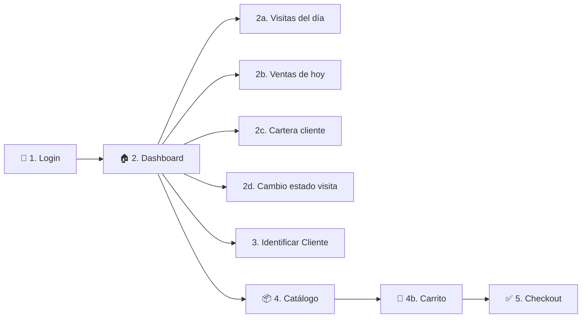

---

## 1. Autenticación — `POST /auth/login`

**Cuándo se usa:** Pantalla de login. Es lo primero que ocurre al abrir la app.

**Misión:** Validar la identidad del vendedor y devolver un token que actúa como "filtro maestro" para todo lo demás.

#### Request

```json
{
  "id_vendedor": "1",
  "password": "contraseña_segura"
}
```

| Campo | Tipo | Obligatorio | Descripción |
|---|---|---|---|
| `id_vendedor` | `string` | ✅ | Identificador único del vendedor |
| `password` | `string` | ✅ | Contraseña definida por la empresa |

#### Lógica Interna

1. Buscar en la tabla `py_vendedores` un registro donde `id = id_vendedor`.
2. Comparar el `password` con el hash almacenado (bcrypt o argon2).
3. Si coincide → generar un JWT con `id_vendedor` embebido.
4. Si no coincide → devolver error 401.

> ⚠️ **Importante:**
> El `id_vendedor` dentro del JWT es el filtro maestro. **Todas** las consultas posteriores deben extraer el `id_vendedor` del token para filtrar datos. Nunca confiar en un `id_vendedor` enviado en el body.

#### Response (200 OK)

```json
{
  "token": "eyJhbGciOiJIUzI1NiIs...",
  "perfil": {
    "id_vendedor": "s1",
    "nombre_vendedor": "Carlos Mendoza"
  }
}
```

#### Response (401 Unauthorized)

```json
{
  "error": "Credenciales inválidas",
  "code": "UNAUTHORIZED"
}
```

#### Diagrama de secuencia: Flujo de Login

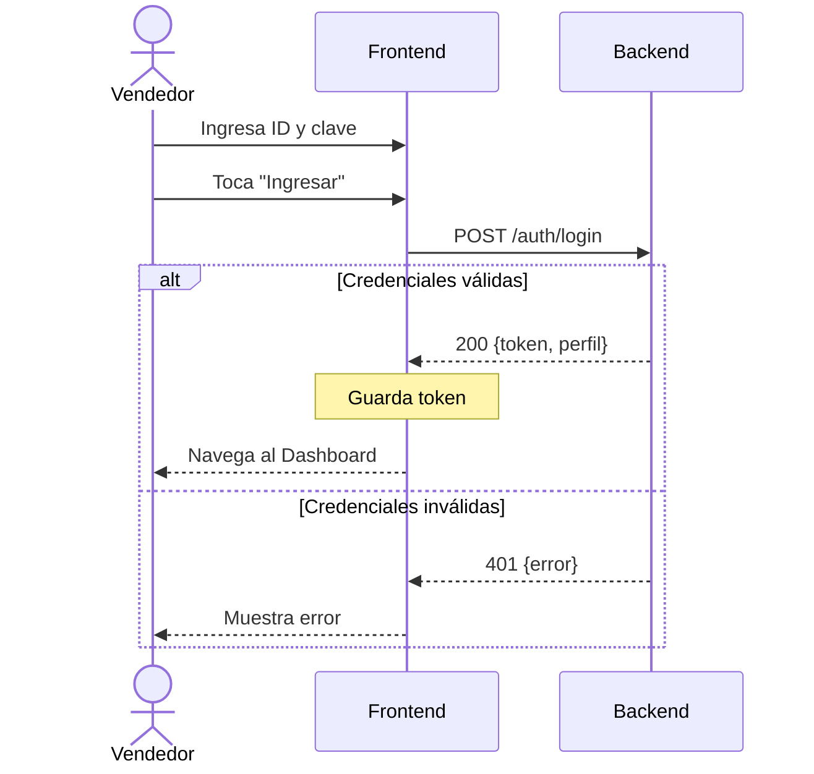

---

## 2. Dashboard — Carga Inicial

Tras el login exitoso, el dashboard necesita cargar **3 cosas simultáneamente**: visitas, ventas del día, y estará listo para consultar cartera bajo demanda.

> ℹ️ **Nota:**
> Los **KPIs** (por visitar, visitando, canceladas) se calculan en el frontend contando visitas por estado. El KPI de **Finalizadas** se calcula contando los **pedidos** del día (`GET /finalizadas` → `pedidos_count`), ya que un mismo cliente puede tener múltiples pedidos completados. No requieren endpoints separados.

---

### 2a. Visitas del Día — `GET /visitas`

**Cuándo se usa:** Al entrar al Dashboard. Devuelve las visitas de **hoy** + visitas **PENDING/IN_PROCESS de días anteriores** (que nunca se completaron ni cancelaron). Alimenta **3 pestañas**: Por visitar, Visitando, Canceladas.

**Cómo lo usa el frontend:** El frontend recibe todas las visitas juntas y las **distribuye automáticamente** en pestañas según `estado`. Además, usa el campo `es_hoy` para agrupar visualmente:

- **Primero**: tarjetas de hoy (arriba)
- **Separador**: `⏰ Anteriores`
- **Después**: tarjetas de días anteriores con badge de fecha (ej: "Mar 7")

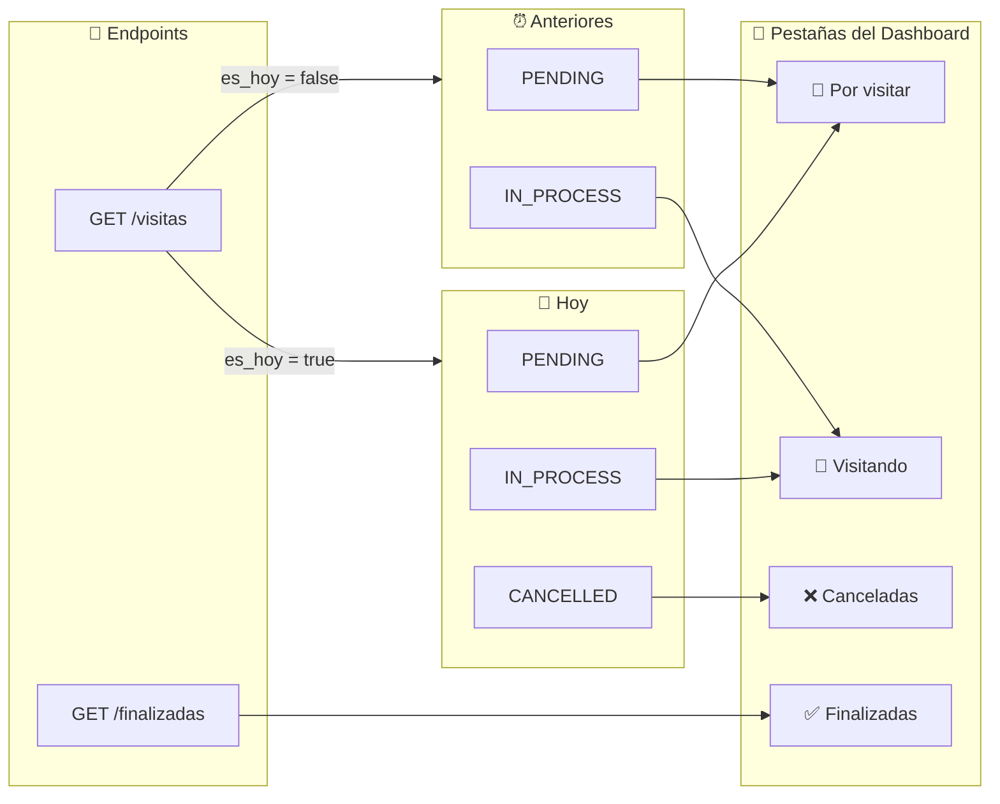

> ⚠️ **Importante:**
> El backend devuelve **todas las visitas en una sola respuesta**. Es el frontend quien filtra por `estado` y agrupa por `es_hoy`. No se necesitan endpoints separados por estado.

> ℹ️ **Nota:**
> Los **KPIs** del dashboard solo cuentan visitas de **hoy** (`es_hoy: true`). Las anteriores aparecen en la lista pero **no inflan los contadores**.

#### Headers

```
Authorization: Bearer <token>
```

#### Lógica Interna

```sql
-- Trae visitas de HOY (todos los estados) + PENDING/IN_PROCESS de días anteriores
SELECT v.*, c.nombre, c.direccion, c.telefono, c.nit,
       CASE WHEN DATE(v.fecha) = CURRENT_DATE THEN true ELSE false END AS es_hoy
FROM py_visitas v
JOIN py_clientes c ON v.cliente_nit = c.nit
WHERE v.vendedor_id = <id_del_token>
  AND (
    DATE(v.fecha) = CURRENT_DATE
    OR (v.estado IN ('PENDING', 'IN_PROCESS') AND DATE(v.fecha) < CURRENT_DATE)
  )
ORDER BY es_hoy DESC, v.fecha ASC
```

> ℹ️ **Nota:**
> Se traen **todas** las visitas pendientes/en proceso sin límite de días. Las canceladas y completadas de días anteriores **no** se incluyen.

#### Response (200 OK)

```json
{
  "visitas": [
    {
      "cliente_nit": "900123456",
      "id_vendedor": "s1",
      "fecha": "2026-02-09T08:00:00-05:00",
      "estado": "PENDING",
      "es_hoy": true,
      "cliente": {
        "nit": "900123456",
        "nombre": "Tienda La Esquina",
        "telefono": "3001234567",
        "direccion": "Calle 123 # 45-67"
      }
    },
    {
      "cliente_nit": "1020304050",
      "id_vendedor": "s1",
      "fecha": "2026-02-09T09:30:00-05:00",
      "estado": "IN_PROCESS",
      "es_hoy": true,
      "cliente": {
        "nit": "1020304050",
        "nombre": "Variedades Doña Rita",
        "telefono": "3109876543",
        "direccion": "Carrera 8 # 20-15"
      }
    },
    {
      "cliente_nit": "654654654",
      "id_vendedor": "s1",
      "fecha": "2026-02-07T10:00:00-05:00",
      "estado": "PENDING",
      "es_hoy": false,
      "cliente": {
        "nit": "654654654",
        "nombre": "Estanquillo La Amistad",
        "telefono": "3156667788",
        "direccion": "Av. Santander # 45-80"
      }
    }
  ]
}
```

#### Estados válidos de visita

| Estado | Pestaña del frontend | ¿Incluye anteriores? | Descripción |
|---|---|---|---|
| `PENDING` | "Por visitar" | ✅ Sí | Visita asignada, aún sin interacción del vendedor |
| `IN_PROCESS` | "Visitando" | ✅ Sí | El vendedor agregó al menos un producto al carrito |
| `COMPLETED` | "Finalizadas" | ❌ No | Se registró un pedido exitosamente |
| `CANCELLED` | "Canceladas" | ❌ No | El vendedor anuló la visita manualmente |

---

### 2b. Resumen de Ventas del Día — `GET /finalizadas`

**Cuándo se usa:** Al entrar al Dashboard, en paralelo con las visitas. Tiene **doble propósito**:
1. Alimenta la pestaña **"Finalizadas"** con la lista de pedidos completados del día.
2. El frontend calcula el widget **"Ventas de Hoy"** (número de pedidos + total en COP) localmente a partir de esta misma respuesta.

> ℹ️ **Nota:**
> El frontend calcula `ventas_total = SUM(pedido.total)` y `pedidos_count = pedidos.length` — no se necesita un cálculo separado del backend para el widget.

#### Headers

```
Authorization: Bearer <token>
```

#### Lógica Interna

```sql
SELECT p.id, p.fecha, p.total, p.estado,
       c.nit, c.nombre AS cliente_nombre, c.direccion, c.telefono
FROM py_pedidos p
JOIN py_clientes c ON p.cliente_nit = c.nit
WHERE p.vendedor_id = <id_del_token>
  AND DATE(p.fecha) = CURRENT_DATE
  AND p.estado = 'COMPLETED'
ORDER BY p.fecha ASC
```

> ℹ️ **Nota:**
> Este endpoint **NO** necesita devolver los items de cada pedido. Solo devuelve el resumen de cada pedido (id, fecha, total, datos del cliente). Los items detallados se obtienen bajo demanda con `GET /pedidos/:nit` (sección 5b) cuando el vendedor toca "VER RESUMEN".

#### Response (200 OK) — Ejemplo: 2 pedidos del día

```json
{
  "pedidos": [
    {
      "id": "ord-123456",
      "fecha": "2026-02-09T08:15:00-05:00",
      "total": 93500,
      "estado": "COMPLETED",
      "items_count": 3,
      "cliente": {
        "nit": "900123456",
        "nombre": "TIENDA LA ESQUINA",
        "telefono": "3001234567",
        "direccion": "Calle 123 # 45-67"
      }
    },
    {
      "id": "ord-789012",
      "fecha": "2026-02-09T14:30:00-05:00",
      "total": 74400,
      "estado": "COMPLETED",
      "items_count": 2,
      "cliente": {
        "nit": "1020304050",
        "nombre": "VARIEDADES DOÑA RITA",
        "telefono": "3109876543",
        "direccion": "Carrera 8 # 20-15"
      }
    }
  ]
}
```

#### Response (200 OK) — Sin pedidos hoy

```json
{
  "pedidos": []
}
```

#### Cómo el frontend usa esta respuesta

| Dato | Cómo se calcula | Dónde se muestra |
|---|---|---|
| Lista de pedidos | Directo del array `pedidos` | Pestaña **"Finalizadas"** — cada pedido es una tarjeta con total + hora + VER RESUMEN |
| `ventas_total` | `pedidos.reduce((sum, p) => sum + p.total, 0)` | Widget **"Ventas de Hoy"** — valor en COP |
| `pedidos_count` | `pedidos.length` | Widget **"Ventas de Hoy"** — número de pedidos |
| KPI Finalizadas | `pedidos.length` | Badge en pestaña "Finalizadas" |

#### Diagrama de secuencia: Carga inicial del Dashboard

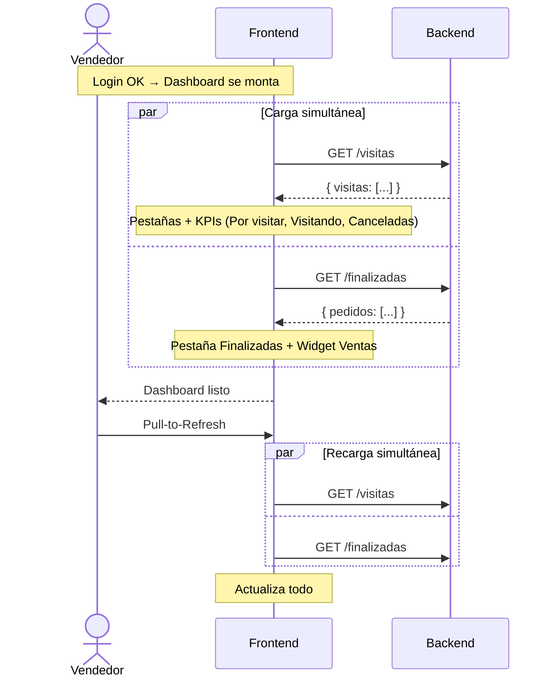

---

### 2c. Cartera del Cliente — `GET /clientes/:nit/cartera`

**Cuándo se usa:** Dentro del Dashboard, cuando el vendedor toca el icono de billetera (💼) en cualquier tarjeta de visita. Abre un modal con las facturas del cliente.

**Misión:** Devolver todas las facturas del cliente con el saldo calculado por el backend, más la cartera total acumulada.

#### Headers

```
Authorization: Bearer <token>
```

#### Lógica Interna

```sql
SELECT
  id,
  numero_factura,
  fecha,
  valor_total,
  total_abonado,
  (valor_total - total_abonado) AS saldo    -- ← Calculado por el backend
FROM py_facturas
WHERE nit = :nit
ORDER BY fecha DESC
```

**Cartera total** (calculada por el backend, no por el frontend):

```sql
SELECT COALESCE(SUM(valor_total - total_abonado), 0) AS cartera_total
FROM py_facturas
WHERE nit = :nit
```

> ⚠️ **Importante:**
> Tanto `saldo` como `cartera_total` **deben ser calculados por el backend**. El frontend solo los muestra, nunca los calcula. Esto garantiza que los números sean consistentes y confiables.

#### Response (200 OK) — Ejemplo con 2 facturas

```json
{
  "nit": "900123456",
  "facturas": [
    {
      "id": "f1",
      "numero_factura": "FAC-10234",
      "fecha": "2026-01-15",
      "valor_total": 485000,
      "total_abonado": 200000,
      "saldo": 285000
    },
    {
      "id": "f2",
      "numero_factura": "FAC-10198",
      "fecha": "2025-12-28",
      "valor_total": 320000,
      "total_abonado": 320000,
      "saldo": 0
    }
  ],
  "cartera_total": 285000
}
```

#### Cómo el frontend interpreta esta respuesta

| Campo | Quién lo calcula | Cómo se muestra |
|---|---|---|
| `valor_total` | Backend (dato de DB) | Texto "Total" en la mini-tarjeta |
| `total_abonado` | Backend (dato de DB) | Texto "Abonos" en la mini-tarjeta |
| `saldo` | **Backend** (`valor_total - total_abonado`) | Texto "SALDO" con color: **rojo** si > 0 (deuda), **verde** si = 0 (pagada) |
| `cartera_total` | **Backend** (`SUM` de todos los saldos) | Footer fijo del modal: "Cartera Total: $285.000" |

> ℹ️ **Nota:**
> En el ejemplo: la factura FAC-10234 tiene saldo $285.000 (deuda pendiente), mientras que FAC-10198 tiene saldo $0 (completamente pagada). La cartera total es $285.000 porque solo suma los saldos pendientes.

#### Diagrama de secuencia: Consulta de cartera

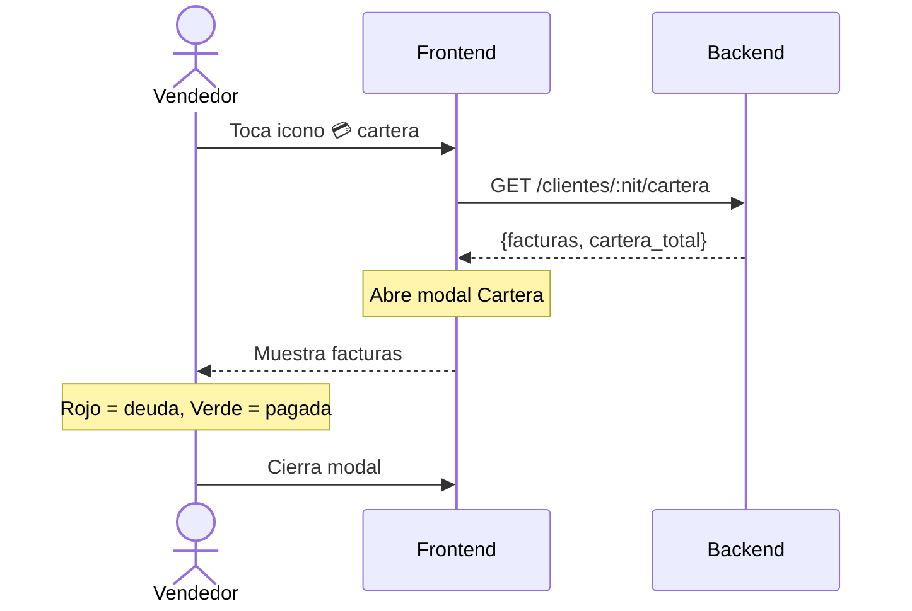

---

### 2d. Cancelar / Reactivar Visita — `PATCH /clientes/:nit/estado`

**Cuándo se usa:** El vendedor toca el icono 🗑️ (papelera) para **cancelar** una visita, o el botón "REACTIVAR VISITA" para **reactivarla**.

**Misión:** Cambiar el estado de una visita entre `CANCELLED` y `PENDING`.

> ℹ️ **Nota:**
> Este endpoint solo maneja las transiciones `PENDING ↔ CANCELLED` e `IN_PROCESS → CANCELLED`. Las transiciones `PENDING ↔ IN_PROCESS` las maneja automáticamente `PUT /clientes/:nit/carrito` (Sección 4c) según si el carrito tiene items o no.

#### Lo que Pymo envía

| Componente | Valor | Ejemplo |
|---|---|---|
| **Método** | `PATCH` | |
| **URL** | `/clientes/:nit/estado` | `/clientes/900123456/estado` |
| **Header** | `Authorization: Bearer <token>` | El token identifica al vendedor |
| **Header** | `Content-Type: application/json` | |

#### Request — Cancelar visita

```json
{
  "estado": "CANCELLED"
}
```

#### Request — Reactivar visita cancelada

```json
{
  "estado": "PENDING"
}
```

| Campo | Tipo | Valores permitidos |
|---|---|---|
| `estado` | `string` | `CANCELLED`, `PENDING` |

#### Transiciones válidas (solo este endpoint)

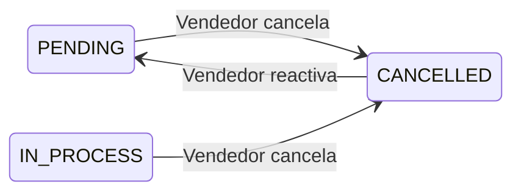

#### Lógica Interna

1. Validar que la visita pertenece al vendedor del token.
2. Validar que la transición sea válida según el diagrama.
3. Si se cancela una visita `IN_PROCESS` → **limpiar** también los items del carrito de esa visita.
4. Actualizar el estado de la visita.

> 🚨 **Advertencia:**
> Al cancelar una visita que está `IN_PROCESS`, el carrito debe limpiarse. Si el vendedor reactiva la visita, arranca de cero con carrito vacío.

#### Lo que Pymo espera recibir

| Campo | Tipo | Descripción |
|---|---|---|
| `nit` | `string` | NIT del cliente cuya visita se actualizó |
| `estado` | `string` | Nuevo estado (`CANCELLED` o `PENDING`) |
| `actualizado_en` | `string` (ISO 8601) | Fecha/hora de la actualización |

#### Response (200 OK)

```json
{
  "nit": "900123456",
  "estado": "CANCELLED",
  "actualizado_en": "2026-02-09T10:30:00-05:00"
}
```

> ℹ️ **Nota:**
> Pymo **no necesita** KPIs en esta respuesta. El frontend recalcula los KPIs automáticamente contando las visitas por estado en su lista local.

#### Errores posibles

| HTTP | Código | Causa |
|---|---|---|
| 403 | `FORBIDDEN` | La visita no pertenece al vendedor del token |
| 409 | `INVALID_TRANSITION` | Transición de estado no válida (ej: `COMPLETED` → `CANCELLED`) |

```json
// Ejemplo: transición inválida
{
  "error": "No se puede cancelar una visita con estado COMPLETED",
  "code": "INVALID_TRANSITION"
}
```

#### Diagrama completo de transiciones (visión global)

Este diagrama muestra **todas** las transiciones y **quién las ejecuta**:

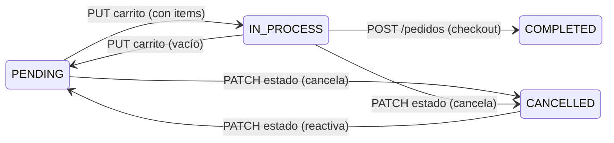

---

## 3. Identificar Cliente — `GET /clientes/buscar/:nit`

**Cuándo se usa:** El vendedor escribe un NIT y presiona "🔍 BUSCAR EN MEKANO Y PYMO".

**Misión:** Buscar un cliente por NIT en la base de datos de Mekano y determinar si ya tiene visitas asignadas con este vendedor hoy.

#### Lo que Pymo envía

| Componente | Valor | Ejemplo |
|---|---|---|
| **Método** | `GET` | |
| **URL** | `/clientes/buscar/:nit` | `/clientes/buscar/555666777` |
| **Header** | `Authorization: Bearer <token>` | El token identifica al vendedor |
| **Body** | *(ninguno)* | Es un GET |

#### Lo que Pymo espera recibir (3 escenarios)

| Escenario | `encontrado_en` | Significado | Qué muestra Pymo |
|---|---|---|---|
| Cliente tiene visitas hoy con este vendedor | `"asignado"` | Ya es cliente activo del vendedor | Tarjeta con datos + estado de visita |
| Cliente existe pero NO tiene visitas con este vendedor | `"no_asignado"` | Existe en Mekano pero no está asignado | Formulario prellenado para "Importar" |
| NIT no existe en la base de datos | `null` | No existe | Formulario vacío para crear nuevo |

#### Response (200 OK) — `"asignado"` — Cliente con visita activa

```json
{
  "encontrado_en": "asignado",
  "cliente": {
    "nit": "900123456",
    "nombre": "TIENDA LA ESQUINA",
    "telefono": "3001234567",
    "direccion": "Calle 123 # 45-67",
    "email": "contacto@laesquina.com"
  },
  "visita": {
    "nit": "900123456",
    "estado": "PENDING",
    "fecha": "2026-02-09T08:00:00-05:00"
  }
}
```

#### Response (200 OK) — `"no_asignado"` — Cliente existe, sin visitas con este vendedor

```json
{
  "encontrado_en": "no_asignado",
  "cliente": {
    "nit": "555666777",
    "nombre": "DISTRIBUIDORA CENTRAL",
    "telefono": "3109876543",
    "direccion": "Av. Industrial # 100-20",
    "email": "ventas@distcentral.com"
  }
}
```

> ℹ️ **Nota:**
> `"no_asignado"` = el cliente existe en Mekano pero **no tiene visitas activas hoy** con este vendedor. Pymo muestra sus datos prellenados y un botón "IMPORTAR Y COMENZAR VISITA".

#### Response (200 OK) — `null` — No encontrado

```json
{
  "encontrado_en": null
}
```

#### Campos del response

| Campo | Tipo | Presente cuando | Descripción |
|---|---|---|---|
| `encontrado_en` | `"asignado"` \| `"no_asignado"` \| `null` | Siempre | Indica dónde se encontró el cliente |
| `cliente.nit` | `string` | `asignado` o `no_asignado` | NIT del cliente (PK) |
| `cliente.nombre` | `string` | `asignado` o `no_asignado` | Nombre/razón social |
| `cliente.telefono` | `string` | `asignado` o `no_asignado` | Teléfono de contacto |
| `cliente.direccion` | `string` | `asignado` o `no_asignado` | Dirección principal |
| `cliente.email` | `string` \| `null` | `asignado` o `no_asignado` | Email (puede ser null) |
| `visita.nit` | `string` | Solo si `asignado` | NIT del cliente (confirma la visita) |
| `visita.estado` | `string` | Solo si `asignado` | `PENDING`, `IN_PROCESS`, o `CANCELLED` |
| `visita.fecha` | `string` (ISO 8601) | Solo si `asignado` | Fecha de la visita |

---

### 3a. Registrar / Importar Cliente — `POST /clientes`

**Cuándo se usa:** El vendedor presiona "GUARDAR Y COMENZAR VISITA" (cliente nuevo) o "IMPORTAR Y COMENZAR VISITA" (cliente existente no asignado).

**Misión:** Crear o adoptar un cliente + crear visita. **Doble propósito:** si el NIT no existe, crea el cliente; si ya existe, lo adopta (actualiza datos si cambiaron) y crea la visita.

#### Lo que Pymo envía

| Componente | Valor | Ejemplo |
|---|---|---|
| **Método** | `POST` | |
| **URL** | `/clientes` | |
| **Header** | `Authorization: Bearer <token>` | El token identifica al vendedor |
| **Header** | `Content-Type: application/json` | |

#### Request

```json
{
  "nit": "900555444",
  "nombre": "NUEVA TIENDA EJEMPLO",
  "telefono": "3001112233",
  "direccion": "Calle 99 # 10-20",
  "email": "tienda@email.com"
}
```

| Campo | Tipo | Obligatorio | Validación |
|---|---|---|---|
| `nit` | `string` | ✅ | Solo numérico, 6–15 caracteres. **Inmutable** — no se puede modificar después de creado |
| `nombre` | `string` | ✅ | 2–100 caracteres, se guarda en MAYÚSCULAS |
| `telefono` | `string` | ✅ | 7–15 caracteres |
| `direccion` | `string` | ✅ | 5–200 caracteres |
| `email` | `string` | ❌ | Formato email válido si se proporciona |

#### Lógica Interna (transacción atómica)

1. Buscar si el NIT ya existe en `py_clientes`.
2. **Si NO existe** (cliente nuevo):
   - Crear registro en `py_clientes`.
   - Crear visita en `py_visitas` (vendedor del token, estado `PENDING`).
3. **Si YA existe** (importar/adoptar):
   - Actualizar datos del cliente si cambiaron (`nombre`, `telefono`, `direccion`, `email`).
   - Crear visita en `py_visitas` (vendedor del token, estado `PENDING`).
4. Devolver cliente + visita.

> ⚠️ **Importante:**
> **Transacción atómica obligatoria.** Si la visita falla, no se debe crear/actualizar el cliente.

#### Response (201 Created)

```json
{
  "cliente": {
    "nit": "900555444",
    "nombre": "NUEVA TIENDA EJEMPLO"
  },
  "visita": {
    "nit": "900555444",
    "estado": "PENDING"
  }
}
```

#### Errores posibles

| HTTP | Código | Causa |
|---|---|---|
| 400 | `INVALID_INPUT` | Campo requerido vacío o formato inválido |
| 409 | `VISIT_EXISTS` | Este vendedor ya tiene una visita activa hoy para este cliente |

#### Lo que Pymo espera recibir (resumen)

| Campo | Tipo | Descripción |
|---|---|---|
| `cliente.nit` | `string` | NIT del cliente |
| `cliente.nombre` | `string` | Nombre del cliente |
| `visita.nit` | `string` | NIT del cliente (confirma la visita) |
| `visita.estado` | `string` | Siempre `"PENDING"` |

---

### 3b. Actualizar Cliente — `PATCH /clientes/:nit`

**Cuándo se usa:** El vendedor presiona "ACTUALIZAR" en la tarjeta de un cliente que ya tiene asignado.

**Misión:** Actualizar los datos de contacto de un cliente existente en la base de datos de Mekano.

#### Lo que Pymo envía

| Componente | Valor | Ejemplo |
|---|---|---|
| **Método** | `PATCH` | |
| **URL** | `/clientes/:nit` | `/clientes/900123456` |
| **Header** | `Authorization: Bearer <token>` | |
| **Header** | `Content-Type: application/json` | |

#### Request — Solo los campos modificados

```json
{
  "nombre": "TIENDA LA ESQUINA ACTUALIZADA",
  "telefono": "3009999999"
}
```

| Campo | Tipo | Obligatorio |
|---|---|---|
| `nombre` | `string` | ❌ (solo si cambió) |
| `telefono` | `string` | ❌ (solo si cambió) |
| `direccion` | `string` | ❌ (solo si cambió) |
| `email` | `string` | ❌ (solo si cambió) |

> 🚨 **Advertencia:**
> El NIT **nunca** se envía en el body — es inmutable y solo se usa como identificador en la URL.

#### Lógica Interna

```sql
UPDATE py_clientes
SET nombre = COALESCE(:nombre, nombre),
    telefono = COALESCE(:telefono, telefono),
    direccion = COALESCE(:direccion, direccion),
    email = COALESCE(:email, email),
    updated_at = NOW()
WHERE nit = :nit
```

#### Response (200 OK)

```json
{
  "actualizado": true,
  "cliente": {
    "nit": "900123456",
    "nombre": "TIENDA LA ESQUINA ACTUALIZADA",
    "telefono": "3009999999",
    "direccion": "Calle 123 # 45-67",
    "email": "contacto@laesquina.com"
  }
}
```

#### Diagrama de secuencia: Flujos de Identificar Cliente

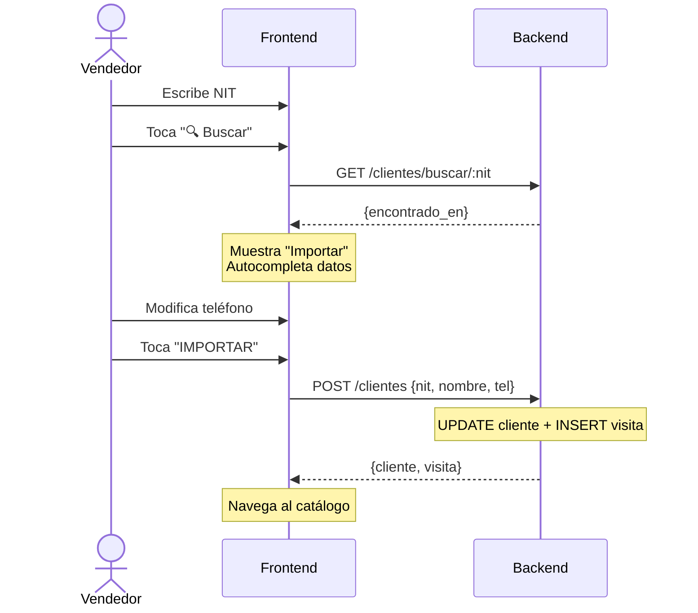

---

### 4a. Catálogo de Productos — `GET /productos`

**Cuándo se usa:** Al tocar "Comenzar Visita" o "Continuar Visita", la app navega al catálogo y carga los productos.

> ⚠️ **Importante:**
> No se exponen **todas** las referencias de Mekano. La tabla `referencias` tiene un campo `pymo_fv` (sí/no) que el equipo de backoffice activa para marcar qué productos se muestran en la app Fuerza de Ventas. Solo se devuelven las referencias con `pymo_fv = true`.

#### Headers

```
Authorization: Bearer <token>
```

#### Lógica Interna

```sql
SELECT r.id, r.sku, r.nombre, r.precio, r.stock,
       r.descripcion, r.imagen_url, r.categoria
FROM referencias r
WHERE r.pymo_fv = true
ORDER BY r.categoria ASC, r.nombre ASC
```

#### Response (200 OK)

```json
{
  "productos": [
    {
      "id": "p1",
      "sku": "LECHE-1L",
      "nombre": "Leche Entera Alquería 1L",
      "precio": 4200,
      "stock": 50,
      "descripcion": "Leche ultrapasteurizada entera",
      "imagen_url": "https://cdn.pymo.app/productos/leche.jpg",
      "categoria": "Lácteos"
    },
  ]
}
```

> ℹ️ **Nota:**
> El catálogo es **global** (no filtrado por vendedor). Todos los vendedores ven los mismos productos marcados con `pymo_fv = true`. El stock es compartido.

---

### 4b. Carrito por Visita — `GET /clientes/:nit/carrito`

**Cuándo se usa:** Cuando el vendedor toca **"Continuar Visita"** en una tarjeta con estado `IN_PROCESS`. El frontend necesita recuperar los productos que el vendedor había guardado en su última sesión.

#### Headers

```
Authorization: Bearer <token>
```

#### Lógica Interna

```sql
SELECT ci.producto_id, ci.cantidad, ci.precio_unitario,
       p.nombre, p.imagen_url, p.sku,
       p.stock AS stock_actual
FROM py_carrito_items ci
JOIN py_productos p ON ci.producto_id = p.id
WHERE ci.cliente_nit = :nit
ORDER BY ci.agregado_en ASC
```

> 🚨 **Advertencia:**
> Validar que la visita pertenece al `id_vendedor` del token. Rechazar con 403 si no coincide.

> ⚠️ **Importante:**
> El campo `stock_actual` permite al frontend detectar si algún producto del carrito guardado ya no tiene stock suficiente. Cuando `stock_actual < cantidad`, el frontend muestra una alerta visual con opción de **nivelar** las cantidades automáticamente.

#### Response (200 OK) — Ejemplo con 2 productos en el carrito

```json
{
  "nit": "555666777",
  "items": [
    {
      "producto_id": "p1",
      "nombre": "Leche Entera Alquería 1L",
      "sku": "LECHE-1L",
      "imagen_url": "https://cdn.pymo.app/productos/leche.jpg",
      "cantidad": 10,
      "precio_unitario": 4200,
      "subtotal": 42000,
      "stock_actual": 50
    },
    {
      "producto_id": "p3",
      "nombre": "Aceite Girasol Gourmet 1L",
      "sku": "ACEITE-1L",
      "imagen_url": "https://cdn.pymo.app/productos/aceite.jpg",
      "cantidad": 3,
      "precio_unitario": 12500,
      "subtotal": 37500,
      "stock_actual": 0
    }
  ],
  "total": 79500
}
```

> ℹ️ **Nota:**
> En el ejemplo anterior, el Aceite tiene `stock_actual: 0` — el frontend debe resaltar ese item como sin stock.

#### Response (200 OK) — Carrito vacío (visita PENDING)

```json
{
  "nit": "555666777",
  "items": [],
  "total": 0
}
```

---

### 4c. Guardar Carrito — `PUT /clientes/:nit/carrito`

**Cuándo se usa:** Únicamente en **2 momentos específicos** (NO en cada cambio de producto):

| Momento | Qué pasa |
|---|---|
| **Vendedor sale del Catálogo → Dashboard** | El frontend guarda el estado actual del carrito antes de navegar |
| **Vendedor toca "Finalizar Pedido"** | El checkout (`POST /pedidos`) ya recibe los items, no necesita un PUT previo — pero si el frontend hace un PUT antes como respaldo, está bien |

> ⚠️ **Importante:**
> **Optimización clave:** Mientras el vendedor está en el catálogo agregando/quitando productos, el carrito se maneja **localmente en la memoria del celular**. Solo se sincroniza con el backend al **salir del catálogo**. Esto evita una llamada HTTP por cada producto tocado.

> ℹ️ **Nota:**
> Mientras el carrito tenga datos locales sin sincronizar, el frontend muestra un aviso sutil en el pie del carrito: *"Carrito no guardado — finaliza el pedido o vuelve al dashboard para guardar."* Este aviso desaparece cuando se completa el checkout o se ejecuta el PUT al salir.

**Estrategia:** Reemplazo total (**PUT**, no PATCH). El frontend envía la lista completa de items. El backend borra los items anteriores y guarda los nuevos.

#### Headers

```
Authorization: Bearer <token>
```

#### Request — Ejemplo: guardar 2 productos al salir del catálogo

```json
{
  "items": [
    { "producto_id": "p1", "cantidad": 10, "precio_unitario": 4200 },
    { "producto_id": "p3", "cantidad": 3, "precio_unitario": 12500 }
  ]
}
```

#### Request — Ejemplo: vendedor eliminó todo y sale del catálogo

```json
{
  "items": []
}
```

#### Lógica Interna (transacción atómica)

Todo ocurre en **una sola transacción**. Si algún paso falla, se revierte todo:

```sql
BEGIN;

-- 1. Validar que la visita pertenece al vendedor del token
SELECT estado FROM py_visitas
WHERE cliente_nit = :nit AND vendedor_id = <id_del_token>
  AND estado IN ('PENDING', 'IN_PROCESS');
-- Si no existe → 403 Forbidden

-- 2. Borrar items anteriores del carrito
DELETE FROM py_carrito_items
WHERE cliente_nit = :nit AND vendedor_id = <id_del_token>;

-- 3. Insertar los nuevos items (si los hay)
INSERT INTO py_carrito_items (cliente_nit, vendedor_id, producto_id, cantidad, precio_unitario)
VALUES (:nit, <id_del_token>, :producto_id, :cantidad, :precio_unitario);
-- Se repite por cada item del array recibido

-- 4. Actualizar automáticamente el estado de la visita
-- Si el carrito tiene items → la visita pasa a IN_PROCESS
-- Si el carrito quedó vacío → la visita vuelve a PENDING
UPDATE py_visitas
SET estado = CASE
    WHEN (SELECT COUNT(*) FROM py_carrito_items WHERE cliente_nit = :nit AND vendedor_id = <id_del_token>) > 0
        THEN 'IN_PROCESS'
    ELSE 'PENDING'
END
WHERE cliente_nit = :nit AND vendedor_id = <id_del_token>
  AND estado IN ('PENDING', 'IN_PROCESS');

COMMIT;
```

> ⚠️ **Importante:**
> El cambio de estado `PENDING ↔ IN_PROCESS` es **automático** y está determinado por el contenido del carrito. El frontend **no** envía el estado — el backend lo calcula. Si hay items → `IN_PROCESS`. Si está vacío → `PENDING`.

#### Response (200 OK)

```json
{
  "nit": "555666777",
  "items_count": 2,
  "total": 79500,
  "estado": "IN_PROCESS"
}
```

#### Response (200 OK) — Carrito vaciado

```json
{
  "nit": "555666777",
  "items_count": 0,
  "total": 0,
  "estado": "PENDING"
}
```

#### Diagrama de secuencia: Flujo completo del carrito

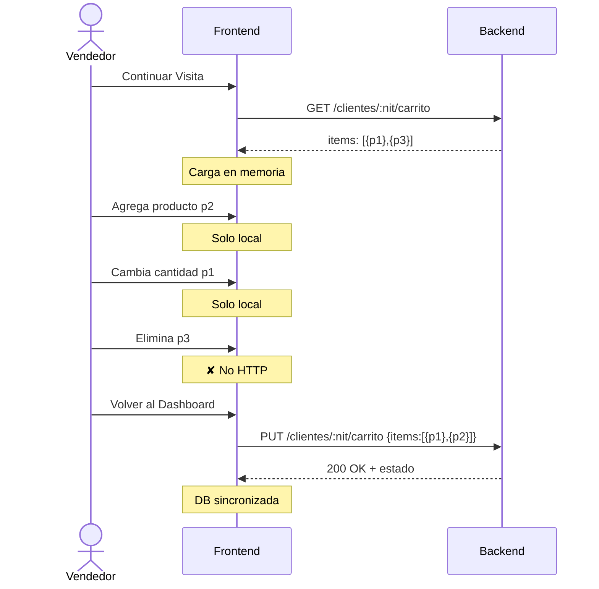

---

## 5. Finalizar Pedido (Checkout) — `POST /pedidos`

**Cuándo se usa:** En la pantalla de Carrito, al tocar "Finalizar Pedido". Es la operación final del flujo de venta.

**Misión:** Registrar el pedido, descontar stock, limpiar el carrito temporal, y marcar la visita como completada. Todo en una sola transacción.

#### Headers

```
Authorization: Bearer <token>
```

#### Request

```json
{
  "nit": "555666777",
  "items": [
    { "producto_id": "p1", "cantidad": 10, "precio_unitario": 4200 },
    { "producto_id": "p3", "cantidad": 3, "precio_unitario": 12500 }
  ],
  "total": 79500
}
```

#### Lógica Interna (transacción atómica)

1. **Validar** que la visita pertenece al vendedor del token.
2. **Validar** stock disponible para cada ítem.
3. **Crear** registro en tabla `py_pedidos` + `py_pedido_items`.
4. **Descontar** stock de cada producto.
5. **Limpiar** `py_carrito_items` de esta visita (ya no se necesitan, pasaron a `py_pedido_items`).
6. **Cambiar** estado de la visita a `COMPLETED`.
7. Si algo falla → rollback completo.

> 🔴 **Cuidado:**
> El `total` enviado por el frontend es informativo. El backend **debe recalcularlo** server-side (`SUM(cantidad × precio_unitario)`) para evitar manipulación.

#### Validaciones de items

| Campo | Validación |
|---|---|
| `nit` | Debe existir, pertenecer al vendedor del token, visita con estado `PENDING` o `IN_PROCESS` |
| `producto_id` | Debe existir y estar activo |
| `cantidad` | Entero ≥ 1 |
| `precio_unitario` | Debe coincidir con el precio actual del producto en `py_productos` |

#### Errores posibles

| HTTP | Código | Causa |
|---|---|---|
| 400 | `INVALID_INPUT` | Campos faltantes o items vacíos |
| 403 | `FORBIDDEN` | La visita no pertenece al vendedor del token |
| 409 | `INSUFFICIENT_STOCK` | Al menos un producto no tiene stock suficiente |
| 409 | `PRICE_MISMATCH` | El `precio_unitario` no coincide con el precio actual |

```json
// Ejemplo: stock insuficiente
{
  "error": "Stock insuficiente para 'Leche Entera Alquería 1L'. Disponible: 5, solicitado: 10",
  "code": "INSUFFICIENT_STOCK",
  "detalle": {
    "producto_id": "p1",
    "stock_disponible": 5,
    "cantidad_solicitada": 10
  }
}
```

> ⚠️ **Importante:**
> Si **cualquier** producto tiene stock insuficiente, se rechaza **TODO** el pedido. No se permite checkout parcial.

#### Response (201 Created)

```json
{
  "pedido": {
    "id": "ord-123456",
    "fecha": "2026-02-09T14:30:00-05:00",
    "total": 79500,
    "estado": "COMPLETED",
    "items_count": 2,
    "cliente": {
      "nit": "555666777",
      "nombre": "DISTRIBUIDORA CENTRAL",
      "telefono": "3201234567",
      "direccion": "Av. Industrial # 100-20"
    },
    "items": [
      {
        "producto_id": "p1",
        "nombre": "Leche Entera Alquería 1L",
        "sku": "LECHE-1L",
        "cantidad": 10,
        "precio_unitario": 4200,
        "subtotal": 42000
      },
      {
        "producto_id": "p3",
        "nombre": "Aceite Girasol Gourmet 1L",
        "sku": "ACEITE-1L",
        "cantidad": 3,
        "precio_unitario": 12500,
        "subtotal": 37500
      }
    ]
  }
}
```

> ⚠️ **Importante:**
> La respuesta incluye `items` y `cliente` dentro del pedido. El frontend necesita estos datos para generar el **PDF** y el mensaje de **WhatsApp** en la pantalla de éxito.

#### Diagrama de secuencia: Flujo completo de Checkout

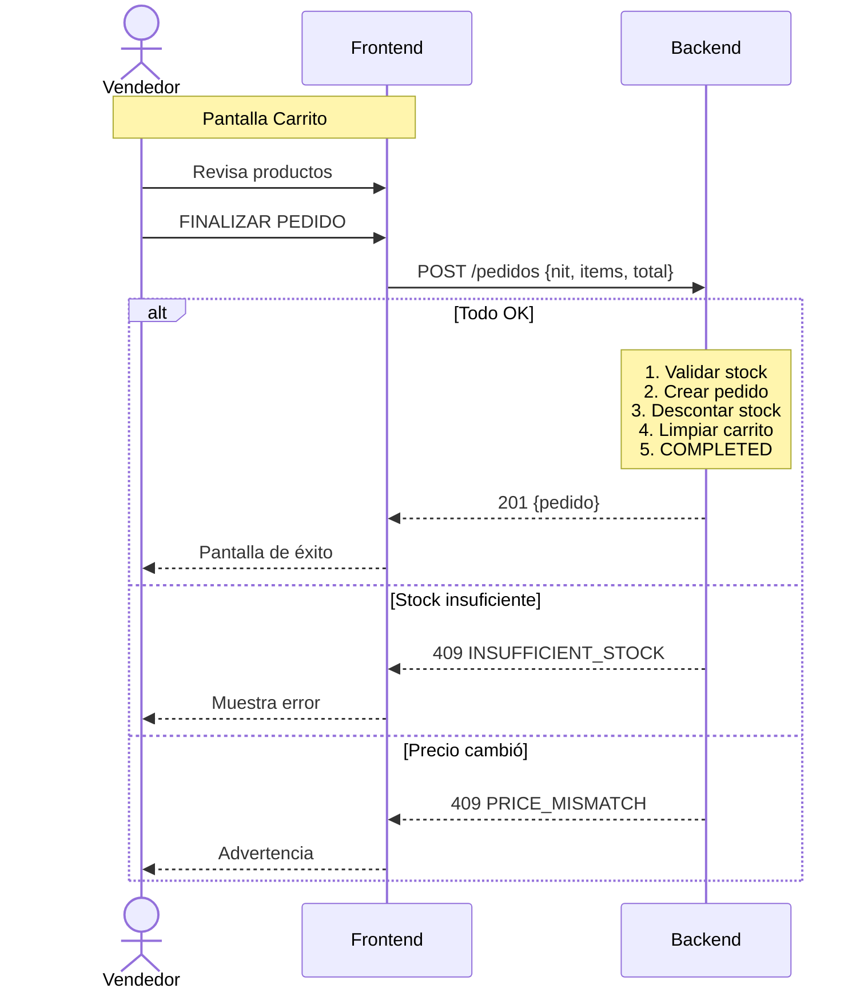

---

### 5b. Items de Pedidos por Cliente — `GET /pedidos/:nit`

**Cuándo se usa:** En **dos lugares**:
1. **Dashboard → Finalizadas**: al tocar "VER RESUMEN" en una tarjeta de pedido.
2. **Identificar Cliente**: al buscar un NIT con visita COMPLETED, se listan **todos** los pedidos del día con VER RESUMEN individual.

**Misión:** Recuperar **todos** los pedidos completados del día para un cliente específico del vendedor. Esto es necesario porque un mismo cliente puede tener **múltiples pedidos** en un día (ej: pedido de la mañana + otro de la tarde).

#### Lo que Pymo envía

| Componente | Valor | Ejemplo |
|---|---|---|
| **Método** | `GET` | |
| **URL** | `/pedidos/:nit` | `/pedidos/987987987` |
| **Header** | `Authorization: Bearer <token>` | El token identifica al vendedor; el tenant lo da la URL del puente |
| **Body** | *(ninguno)* | Es un GET |

#### Lógica Interna

```sql
SELECT p.id, p.fecha, p.total, p.estado,
       pi.producto_id, pi.cantidad, pi.precio_unitario, pi.subtotal,
       pr.nombre, pr.sku, pr.imagen_url,
       c.nit, c.nombre AS cliente_nombre, c.direccion, c.telefono
FROM py_pedidos p
JOIN py_pedido_items pi ON p.id = pi.pedido_id
JOIN py_productos pr ON pi.producto_id = pr.id
JOIN py_clientes c ON p.cliente_nit = c.nit
WHERE p.cliente_nit = :nit
  AND p.vendedor_id = <id_del_token>
  AND DATE(p.fecha) = CURRENT_DATE
  AND p.estado = 'COMPLETED'
ORDER BY p.fecha ASC
```

> 🚨 **Advertencia:**
> Validar que los pedidos pertenecen al `id_vendedor` del token. Rechazar con 403 si no coincide.

> ℹ️ **Nota:**
> Este endpoint devuelve **todos** los pedidos del cliente en el día, no solo el último. El frontend muestra cada pedido como una mini-tarjeta con total + hora + botón VER RESUMEN.

#### Response (200 OK) — Ejemplo: 2 pedidos del mismo cliente

```json
{
  "pedidos": [
    {
      "id": "ord-123456",
      "fecha": "2026-02-09T08:15:00-05:00",
      "total": 93500,
      "estado": "COMPLETED",
      "items": [
        {
          "producto_id": "p1",
          "nombre": "Leche Entera Alquería 1L",
          "sku": "LECHE-1L",
          "imagen_url": "https://cdn.pymo.app/productos/leche.jpg",
          "cantidad": 10,
          "precio_unitario": 4200,
          "subtotal": 42000
        },
        {
          "producto_id": "p2",
          "nombre": "Arroz Diana Premium 500g",
          "sku": "ARROZ-500",
          "imagen_url": "https://cdn.pymo.app/productos/arroz.jpg",
          "cantidad": 5,
          "precio_unitario": 2800,
          "subtotal": 14000
        },
        {
          "producto_id": "p4",
          "nombre": "Jabón Dove Original x3 Und",
          "sku": "JABON-BA",
          "imagen_url": "https://cdn.pymo.app/productos/jabon.jpg",
          "cantidad": 3,
          "precio_unitario": 12500,
          "subtotal": 37500
        }
      ]
    },
    {
      "id": "ord-789012",
      "fecha": "2026-02-09T14:30:00-05:00",
      "total": 74400,
      "estado": "COMPLETED",
      "items": [
        {
          "producto_id": "p5",
          "nombre": "Atún Van Camps 160g",
          "sku": "ATUN-160",
          "imagen_url": "https://cdn.pymo.app/productos/atun.jpg",
          "cantidad": 8,
          "precio_unitario": 5300,
          "subtotal": 42400
        },
        {
          "producto_id": "p6",
          "nombre": "Jugo Hit Naranja 1L",
          "sku": "JUGO-1L",
          "imagen_url": "https://cdn.pymo.app/productos/jugo.jpg",
          "cantidad": 8,
          "precio_unitario": 4000,
          "subtotal": 32000
        }
      ]
    }
  ],
  "cliente": {
    "nit": "987987987",
    "nombre": "PAPELERÍA Y MISCELÁNEA",
    "direccion": "Calle 72 # 5-05",
    "telefono": "3145556677"
  }
}
```

#### Response (200 OK) — Sin pedidos para este NIT hoy

```json
{
  "pedidos": [],
  "cliente": {
    "nit": "987987987",
    "nombre": "PAPELERÍA Y MISCELÁNEA",
    "direccion": "Calle 72 # 5-05",
    "telefono": "3145556677"
  }
}
```

#### Cómo el frontend muestra esta respuesta

**En Identificar Cliente** (busca NIT → visita COMPLETED):

> **📋 Pedidos de Hoy (2)**
>
> | Total | Hora | Productos | Acción |
> |---|---|---|---|
> | **$93.500** | 08:15 a.m. | 3 prod. | `[VER RESUMEN]` |
> | **$74.400** | 02:30 p.m. | 2 prod. | `[VER RESUMEN]` |
>
> `[ NUEVA VISITA → ]`

**En Dashboard → Finalizadas**: cada pedido ya es una tarjeta individual con su propio VER RESUMEN.

#### Diagrama de secuencia: VER RESUMEN (multi-pedido)

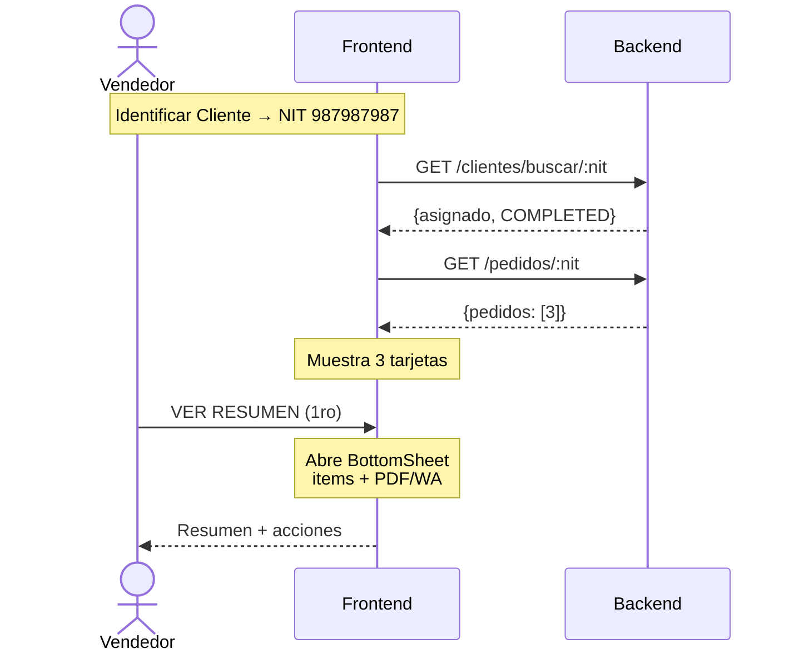

---

### 5c. PDF y WhatsApp — Generación en el frontend

El **PDF** y el mensaje de **WhatsApp** dependen de los **datos del pedido que vienen del backend** (secciones 5 y 5b). Con esos datos ya disponibles, el frontend se encarga de **generar el archivo PDF** y **componer el mensaje de WhatsApp** localmente — no requieren endpoints adicionales más allá de los ya documentados.

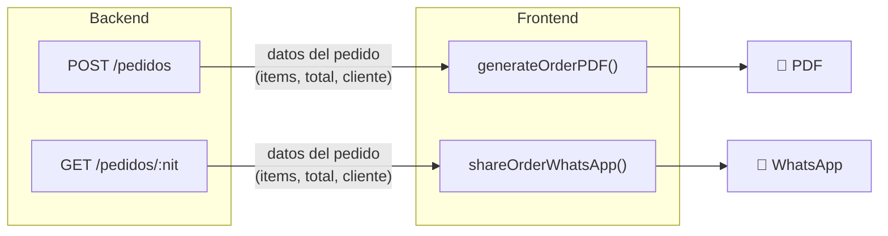

| Función | Tecnología | Ubicación | Datos que usa (del backend) |
|---|---|---|---|
| **Descargar PDF** | `jsPDF` + `jspdf-autotable` | `app/utils/orderSharing.ts` → `generateOrderPDF()` | Pedido (items, total, fecha, ID) + Cliente (nombre, NIT, dirección, teléfono) + Vendedor (nombre) |
| **Compartir WhatsApp** | URL `wa.me` con mensaje formateado | `app/utils/orderSharing.ts` → `shareOrderWhatsApp()` | Mismos datos que el PDF |

**Dónde aparecen los botones:**
- En el `VisitSummarySheet` (resumen de pedido) — accesible desde Dashboard y desde Identificar Cliente
- En la pantalla de éxito del checkout (después de FINALIZAR PEDIDO)

> ⚠️ **Importante:**
> Los datos para el PDF y WhatsApp **vienen del backend** — del response de `POST /pedidos` (al hacer checkout) o `GET /pedidos/:nit` (al consultar pedidos). El frontend **no inventa datos** — solo los formatea como PDF o como mensaje. Por eso es crítico que esos endpoints devuelvan los items completos con nombre, SKU, cantidad, precio y datos del cliente.

> 💡 **Tip:**
> **Mejora futura:** La generación de PDF podría trasladarse al backend con `GET /pedidos/:id/pdf` para mayor control de formato y branding, devolviendo `Content-Type: application/pdf` como binario.

---

## Esquema de Base de Datos

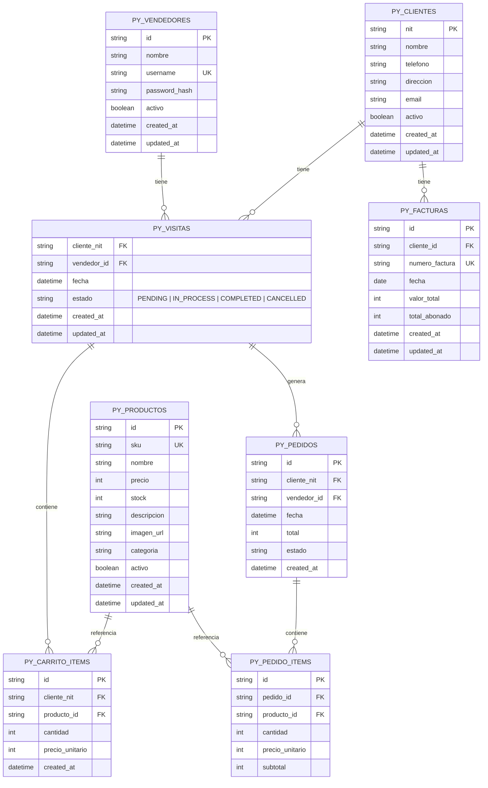

### Notas sobre el esquema

| Convención | Detalle |
|---|---|
| `PK` | Primary Key — identificador único, usar UUID v4 |
| `FK` | Foreign Key — referencia a otra tabla |
| `UK` | Unique Key — campo con restricción de unicidad |
| `created_at` | Timestamp automático al crear el registro |
| `updated_at` | Timestamp automático al modificar (null si nunca se modificó) |
| `activo` | Soft delete — `false` para registros deshabilitados, nunca se borran físicamente |
| `subtotal` | Calculado como `cantidad × precio_unitario`, almacenado para evitar recalcular |

> ℹ️ **Nota:**
> `PY_PRODUCTOS` en este esquema corresponde a la tabla `referencias` de Mekano, filtrada por `pymo_fv = true`. Si en Mekano la tabla se llama distinto, los JOINs de los SQL anteriores deben apuntar al nombre real.

---

## Referencia Rápida de Endpoints

> ℹ️ **Nota:**
> Todos los endpoints usan la **URL base del tenant** configurada en `.env.local` (ej: `https://fruggy.pymo.io/api`). Todos excepto login requieren `Authorization: Bearer <token>`.

| # | Endpoint | Acción del Backend | Disparado por | Resultado Visual |
|---|---|---|---|---|
| 1 | `POST /auth/login` | Valida credenciales, devuelve JWT + perfil | 🔐 Botón **"Ingresar"** | Navega al Dashboard |
| 2a | `GET /visitas` | Visitas de hoy + pendientes de días anteriores | 🏠 Automático al abrir Dashboard | Tarjetas en 3 pestañas + KPIs + separador ⏰ Anteriores |
| 2b | `GET /finalizadas` | Pedidos completados del día | 🏠 Automático al abrir Dashboard | Pestaña Finalizadas + widget Ventas de Hoy |
| 2c | `GET /clientes/:nit/cartera` | Facturas con saldo calculado + cartera total | 🏠 Icono **💳** en tarjeta | Modal con lista de facturas y cartera total |
| 2d | `PATCH /clientes/:nit/estado` | Cancela o reactiva visita | 🏠 Icono **🗑️** / **"REACTIVAR"** | Tarjeta cambia de pestaña (animación) |
| 3 | `GET /clientes/buscar/:nit` | Busca NIT, indica si está asignado | 👆 Botón **"🔍 BUSCAR"** | Tarjeta del cliente o formulario vacío |
| 3a | `POST /clientes` | Crea o adopta cliente + visita PENDING | 👆 **"GUARDAR Y COMENZAR"** / **"IMPORTAR"** | Navega al Catálogo |
| 3b | `PATCH /clientes/:nit` | Actualiza datos de contacto | 👆 Botón **"ACTUALIZAR ✅"** | Toast de confirmación |
| 4a | `GET /productos` | Catálogo filtrado por `pymo_fv = true` | 📦 Automático al entrar | Grid de productos con stock y precio |
| 4b | `GET /clientes/:nit/carrito` | Carrito guardado con `stock_actual` | 📦 **"CONTINUAR VISITA"** | Catálogo con carrito precargado (+ alerta si hay stock insuficiente) |
| 4c | `PUT /clientes/:nit/carrito` | Reemplaza carrito + auto-transición estado | 📦 Automático al **salir** del Catálogo | Vuelve al Dashboard (tarjeta refleja nuevo estado) |
| 5 | `POST /pedidos` | Crea pedido, descuenta stock, → COMPLETED | 🛒 **"FINALIZAR PEDIDO"** | Pantalla de éxito con botones PDF y WhatsApp |
| 5b | `GET /pedidos/:nit` | Pedidos del día con items detallados | 🏠👆 **"VER RESUMEN"** | BottomSheet con items + total + PDF/WhatsApp |

### Notas

- **Automáticos:** 2a, 2b, 4a se disparan al **entrar** a la pantalla, sin intervención del usuario.
- **4c (guardar carrito):** Se llama al **salir** del catálogo, no al agregar cada producto. Los cambios se acumulan en memoria local.
- **3a (crear cliente):** Es un 2-en-1: crea el cliente + la visita, y navega automáticamente al catálogo.
- **Pull-to-Refresh (↻):** Re-dispara 2a y 2b simultáneamente. Los KPIs se recalculan en el frontend.
- **PDF y WhatsApp:** Se generan localmente en el frontend con datos del response de 5 o 5b. No requieren endpoints adicionales.

---

## Reglas de Negocio Consolidadas

Referencia rápida de todas las reglas de negocio críticas, extraídas de los endpoints individuales.

### Datos inmutables

| Campo | Regla |
|---|---|
| `nit` (cliente) | **Inmutable**. Se define al crear el cliente y nunca se modifica. Sirve como identificador único de negocio |
| `id` (cualquier entidad) | Generado por el backend (UUID v4). El frontend nunca envía IDs |

### Transiciones de estado de visita

| Desde | Hasta | Quién lo ejecuta | Endpoint |
|---|---|---|---|
| `PENDING` | `IN_PROCESS` | Automático | `PUT /clientes/:nit/carrito` (al guardar items > 0) |
| `IN_PROCESS` | `PENDING` | Automático | `PUT /clientes/:nit/carrito` (al vaciar carrito) |
| `IN_PROCESS` | `COMPLETED` | Automático | `POST /pedidos` (checkout exitoso) |
| `PENDING` | `CANCELLED` | Manual | `PATCH /clientes/:nit/estado` |
| `IN_PROCESS` | `CANCELLED` | Manual | `PATCH /clientes/:nit/estado` |
| `CANCELLED` | `PENDING` | Manual | `PATCH /clientes/:nit/estado` |

### Cálculos que SOLO hace el backend

| Cálculo | Dónde |
|---|---|
| `saldo` = `valor_total - total_abonado` | Cartera del cliente |
| `cartera_total` = `SUM(saldos)` | Cartera del cliente |
| `total` del pedido = `SUM(cantidad × precio_unitario)` | Checkout |

> ℹ️ **Nota:**
> Los **KPIs** por_visitar, visitando y canceladas se calculan en el **frontend** contando visitas por estado. El KPI de **finalizadas** y el widget **Ventas de Hoy** (`ventas_total`, `pedidos_count`) se calculan en el **frontend** a partir del array de pedidos de `GET /finalizadas`.

### Transacciones atómicas obligatorias

| Operación | Tablas involucradas | Rollback si falla |
|---|---|---|
| Crear cliente | `py_clientes` + `py_visitas` | Eliminar cliente huérfano |
| Guardar carrito | `DELETE + INSERT py_carrito_items` + `UPDATE py_visitas.estado` | Dejar carrito anterior intacto |
| Checkout | `py_pedidos` + `py_pedido_items` + `UPDATE stock` + `DELETE py_carrito_items` + `UPDATE py_visitas.estado` | No descontar stock, no crear pedido |

### Seguridad: Filtro por vendedor

Toda consulta debe extraer `id_vendedor` del JWT. **Nunca** confiar en un `id_vendedor` enviado en el body. Validar que el recurso (visita, pedido) pertenece al vendedor antes de ejecutar cualquier operación.